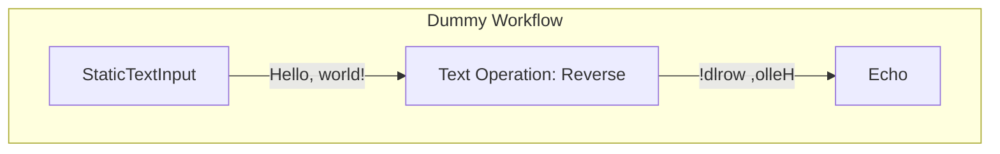

# Development

## Dummy Workflow

Dummy workflow is an example workflow to show how the workflow engine works.

The workflow consists of 3 steps:

1. Step 1: Static text input (Hello, world!)
2. Step 2: Text operation, reverse text
3. Step 3: Print text

### Workflow

Flowchart of the workflow:



### Structure

Here is the JSON structure of the workflow:

```json
{
  "name": "Dummy Workflow",
  "steps": [
    { "type": "StaticTextInput", "input": "Hello, world!" },
    { "type": "TextOperations.Reverse" },
    { "type": "Echo" }
  ]
}
```

### Execution Process

The execution process of the workflow is as follows:

1. The workflow is created via the API or UI.
2. The system queues the workflow.
3. Each step is executed in order.
4. As each step is executed, the system updates the workflow status and the step status.
5. The workflow is marked as completed when all steps are completed.
6. User can be notified via webhook, email, or other means.
